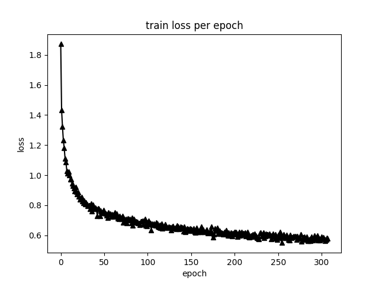
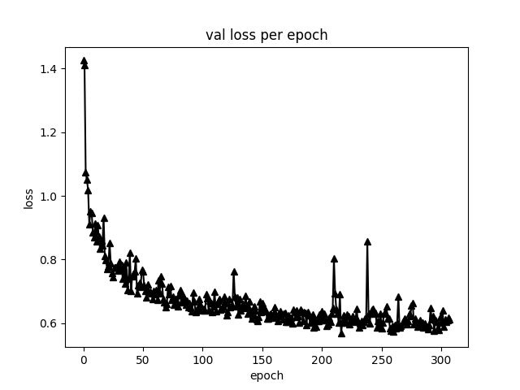

# 项目介绍

利用语义分割技术（DeepLabV3模型）对城市街景图像进行精细化分析，提取道路、建筑物、植被等景观要素的比例，并结合Siamese网络和Place Pulse 2数据集，生成街景图像在美丽感、安全感和无聊感三个维度的评分。通过量化景观要素与用户主观评分之间的关系，揭示不同景观要素对市民感知的影响机制，从而为健身步道的科学选址和设计优化提供数据支持。

# 借鉴的教程

[Pytorch移植Deeplabv3训练CityScapes数据集详细步骤_cityscapes pytorch-CSDN博客](https://blog.csdn.net/qq_41964545/article/details/115252939)

# 项目过程

1. 利用 DeepLabV3 进行街景语义分割，提取道路、建筑物、植被等景观要素比例。
2. 基于 Siamese 网络结合 Place Pulse2 训练街景美丽感、安全感、无聊感评分模型。
3. 采用 Pearson 相关性分析探究景观要素与评分关系。
4. 使用语义分割模型和评分模型对杨浦区街景进行评分，并基于ArcGIS平台实现多维评分结果的空间可视化，为后续选址决策提供数据支撑。

# 模型性能

## DeeplabV3（20class）

## Siamese

| 维度      | 数据量（万） | 最低验证损失 | 最优准确率（%） |
| --------- | ------------ | ------------ | --------------- |
| beautiful | 17           | 0.3487       | 66.35           |
| boring    | 12           | 0.3780       | 59.83           |
| safe      | 36           | 0.3713       | 62.79           |

# 部分结果

## beautiful维度

    景物比例与“Beautiful”评分的Pearson相关性系数

| 景观要素      | r      | p     | 景观要素   | r      | p     |
| ------------- | ------ | ----- | ---------- | ------ | ----- |
| Road          | 0.006  | 0.042 | Sky        | -0.495 | 0.000 |
| Sidewalk      | -0.187 | 0.000 | Person     | -0.124 | 0.000 |
| Building      | -0.438 | 0.000 | Rider      | -0.034 | 0.000 |
| Wall          | -0.101 | 0.000 | Car        | 0.023  | 0.000 |
| Fence         | -0.209 | 0.000 | Truck      | -0.153 | 0.000 |
| Pole          | -0.265 | 0.000 | Bus        | -0.045 | 0.000 |
| Traffic_Light | -0.113 | 0.000 | Train      | -0.012 | 0.000 |
| Traffic_Sign  | -0.231 | 0.000 | Motorcycle | -0.022 | 0.000 |
| Vegetation    | 0.831  | 0.000 | Bicycle    | -0.066 | 0.000 |
| Terrain       | 0.402  | 0.000 | Other      | -0.384 | 0.000 |

