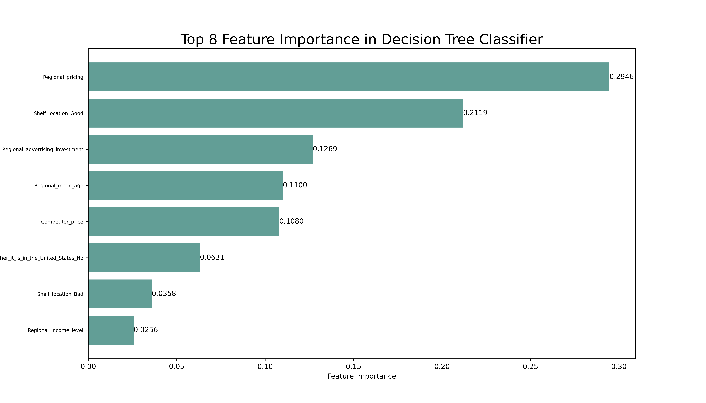
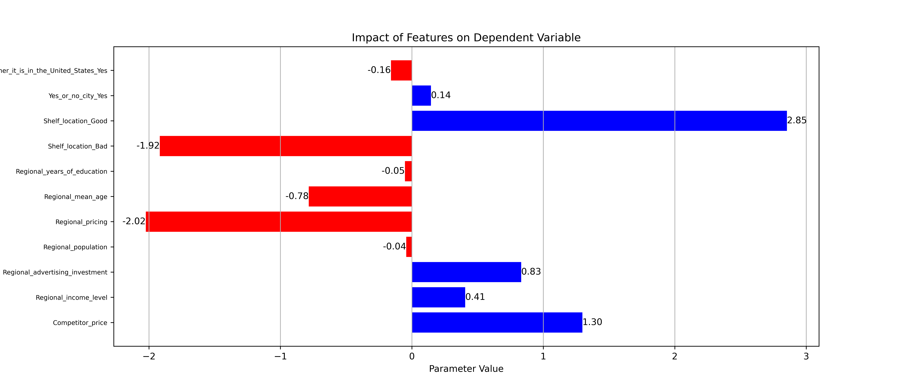

# 项目介绍

对儿童座椅销售数据进行数据分析，找出对销售额影响大的特征并得到各特征对销售额的影响。

# 项目过程

1. 对销售数据进行初步预处理与异常值检测（采用Z-score和IQR方法），生成统计特征及分类频数。
2. 利用One-Hot Encording和特征工程构建处理数据，生成二分类变量（High，销售额≥8）。
3. 构建并优化决策树分类器（含成本复杂度修剪与可视化），找出对销售额影响大的特征，并评估模型准确率、精准率和召回率。
4. 使用梯度下降线性回归模型，通过网格搜索调参，分析各特征对销售额的影响，并绘制学习曲线和参数条形图。

# 模型性能

## 决策树

|              | precision | recall | f1-score | support |
| ------------ | --------- | ------ | -------- | ------- |
| 1            | 0.72      | 0.76   | 0.74     | 38      |
| 0            | 0.77      | 0.73   | 0.75     | 41      |
| accuracy     |           |        | 0.75     | 79      |
| macro avg    | 0.75      | 0.75   | 0.75     | 79      |
| weighted avg | 0.75      | 0.75   | 0.75     | 79      |

## 梯度下降线性回归模型

最佳参数: {'learning_rate': 0.01, 'n_iterations': 3000}
测试集均方误差(MSE): 1.343533450408467

# 部分可视化结果

## 特征重要性前八

## 各特征影响

